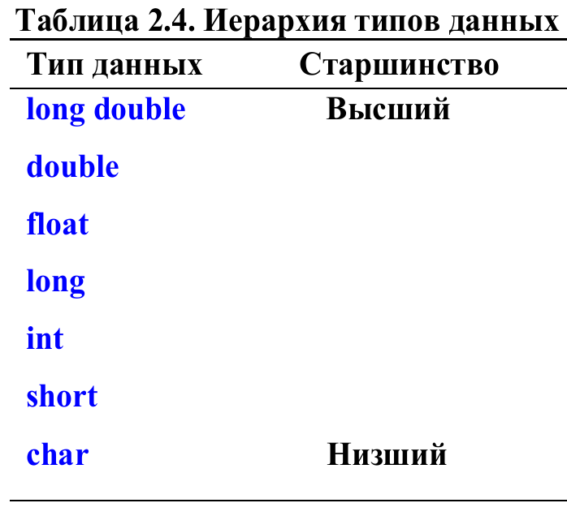

// Справка

``````
// -- это однострочный комментарий

/* */ -- это двустрочный комментарий

cout << "Hello" -- выводит текст Hello.

cin << num -- запрашиваем ввод в переменную **num**.
``````

## Требование к занимаемой памяти типов данных


## Приоритет типов данных


## Приоритет операций

